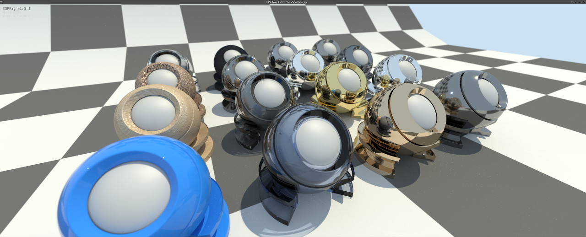

# example_materials
A set of example materials in OSPRay



run as:
```
./ospExampleViewer knobs.ospsg -vp 3.671165 1.327651 -1.469197 -vu 0.000000 1.000000 0.000000 -vi 2.475927 -0.222146 1.035521 --no-plane
```

currently resolving a few issues with materials.  Material instancing not yet supported, so every material has its own obj model.  
